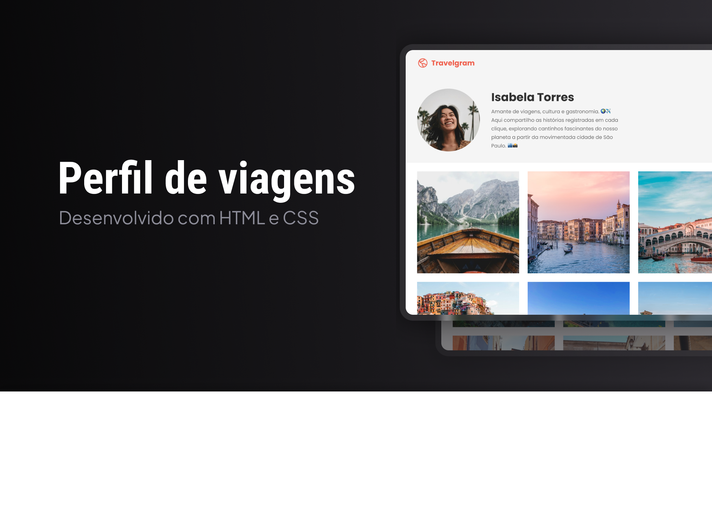

<h1 align="center"> Perfil de Viagens </h1>

Projeto de galeria de viagens desenvolvido para praticar estruturação com HTML e organização modular de estilos com CSS. 

<a href="#projeto">Projeto</a>&nbsp;&nbsp;&nbsp;|&nbsp;&nbsp;&nbsp;
  <a href="#tecnologias-utilizadas">Tecnologias</a>&nbsp;&nbsp;&nbsp;|&nbsp;&nbsp;&nbsp;
  <a href="#funcionalidades">Funcionalidades</a>

 

## Projeto

Travelgram é uma página de perfil com galeria de viagens desenvolvida para praticar fundamentos de HTML e CSS, com foco em estruturação de layout, organização visual do conteúdo e separação dos estilos em arquivos modulares por seção da interface.

## Tecnologias utilizadas

- HTML
- CSS
- Git
- GitHub
- Figma

## Funcionalidades

- Exibição de perfil de viagem com informações do usuário
- Galeria visual com fotos de destinos
- Estrutura organizada em seções como navegação, perfil, galeria e rodapé
- Organização modular dos estilos em arquivos CSS separados

## Projeto online

- [Acesse o projeto finalizado, online](https://felipe-hendrich.github.io/projeto-travelgram/)

## Aprendizados

Neste projeto, pratiquei:

- estruturação de páginas com HTML
- estilização e organização visual com CSS
- separação de estilos por partes da interface
- organização de arquivos para melhorar a manutenção do projeto
- uso de Git e GitHub para versionamento

## Créditos

Projeto desenvolvido com base no conteúdo FullStack, da Rocketseat, com personalizações aplicadas durante a prática.